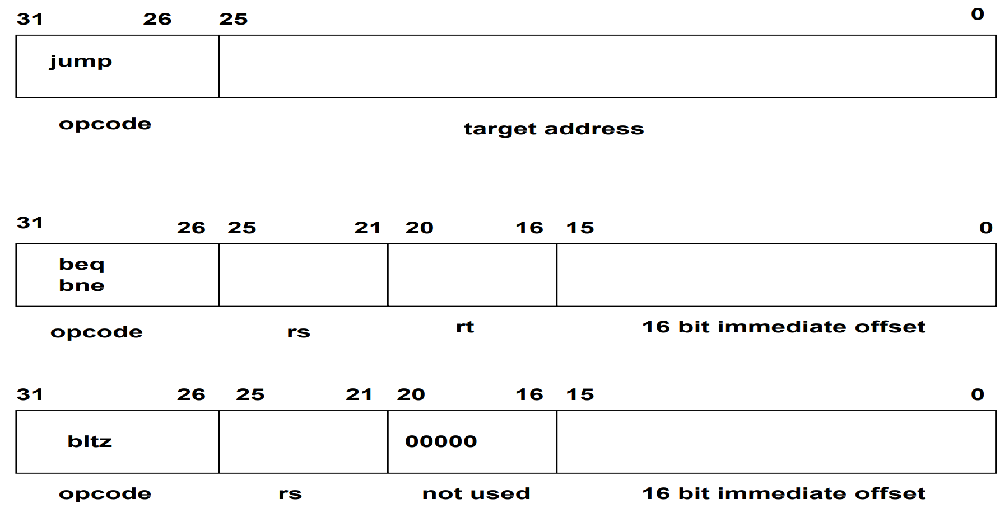
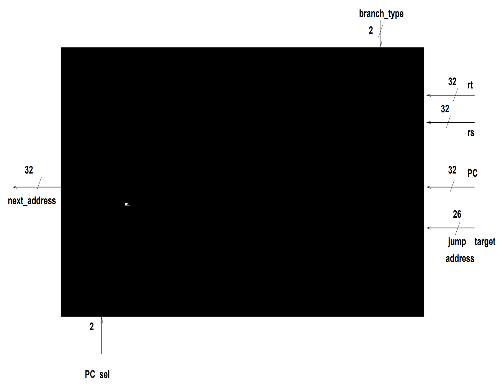
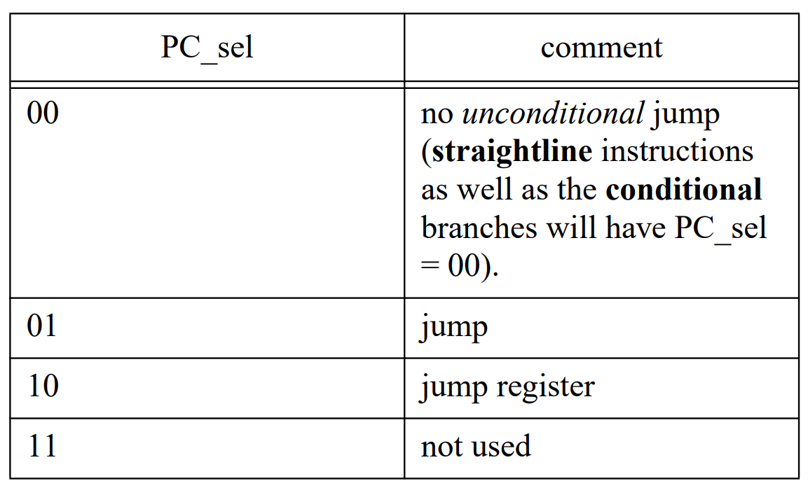
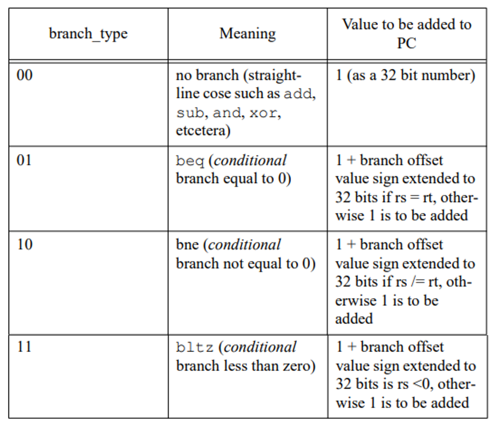

# Next-Address Unit
The Next-Address unit is responsible for generating the next address which is to be stored in the Program Counter (PC) register

## Instruction Format

## Black-Box

## PC Select Functionality

## Branch Types

